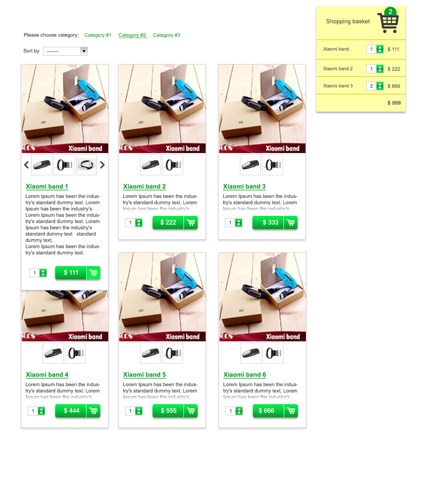

Frontend test
===========
You should create simple application with shopping basket functionality. All data needed to complete this goal is presented in the current repository.



Project structure
--------------------
```
Destination           | Description
--------------------- | ----------------------
data/                 | 
   categories.json    | List of all categories
   galleries.json     | List of all galleries
   products.json      | List of all products
images/               | Dir with galleries
   gallery1/          |
   gallery2/          |
   ...                |
   galleryN/          |
lib/                  | 3rd party libraries go here
psd/                  | Contains needed PSD sources
src/                  | Your source goes here
index.html            | Application entry point
README.md             | This readme
```


Data structure
-----------------

- Project **HAS ONE** Category specified by ```category_id``` field
- Project **HAS ONE** Gallery specified by ```gallery_id``` field
- Gallery **CONSISTS OF** multiple images

Gallery structure
--------------------
If we have next gallery:
```json
{ 
  "galleries": [
    {
      "id": "some_gallery_id",
      "images": [
        "1.jpg",
        "2.png"
      ]
    }
  ]
}
```
 it means that pictures should be loaded by next paths:
 
```
images/some_gallery_id/1.jpg
images/some_gallery_id/2.png

etc...
```

Task description
-------------------
This task is about creating simple single page application with shopping basket functionality which consists of few products from different categories.

- All products, categories and galleries should be loaded from the proper json file
- By default products from all **categories** should be shown, if there is no category filter selected
- If some of the top **category** filters selected - products from only corresponding category should be shown
- There should be next **sorting** modes  - None, Sorting by price in ascending order, Sorting by price in descending mode
- By clicking green button - product should appears in the right shopping basket
- Layout of all buttons should be done using **CSS gradients**
- Hover/Click on any of buttons (including buttons with arrows in quantity fields) **should change button background gradient colors**
- **The Sorting drop-down** can be either custom designed or just system default
- The item images should be **displayed as gallery** - if there are more than 3 images, the arrows should appear which scrolls images
- Available items count is taken from proper JSON (products[@EACH].quantity) and be decreased by already added to the basket count of exact item
- In products list, if there are no any more affordable items available for 'buying' - **Buy button should become disabled with gray background gradient colors, but still
should show how much this item would cost**. Also, quantity field which is located to the left from the button should have zero (0) as its value and be disabled too.
- User could specify quantity of products she wants to buy. Maximum quantity of the specific product could be taken from products dataset.
- User could increase quantity of products in the right panel, but could not exceed maximal quantity of the specific product. 
- User could decrease quantity of products in the right panel. If number of product is equal 0, product should disappear from the right panel.
- Page should store it's state using cookie, localStorage, etc - so if user will reload page - products user selected before should appear in the right panel
- Final price should be calculated
- By clicking on the product main thumbnail or some of additional thumbnails  - some gallery containing product pictures should appear
- The layout of the web page should be responsive. The position of different blocks on mobiles - up to you.

Requirements
-----------------
- All sources should be committed to public source repository, such as: http://github.com, http://bitbucket.org, etc
- HTML5 doctype should be used
- CSS3 should be used
- Feel free to use 3rd party libraries and frameworks (like jQuery, backbone, sass etc...)

Additional plus
-----------------
- Using any of module loader (e.g. require.js)
- Using Task Runner (e.g. Gulp) for concatenation, minifying etc
- Item images gallery touch support (not only by clicking the buttons, but sliding the finger on images)